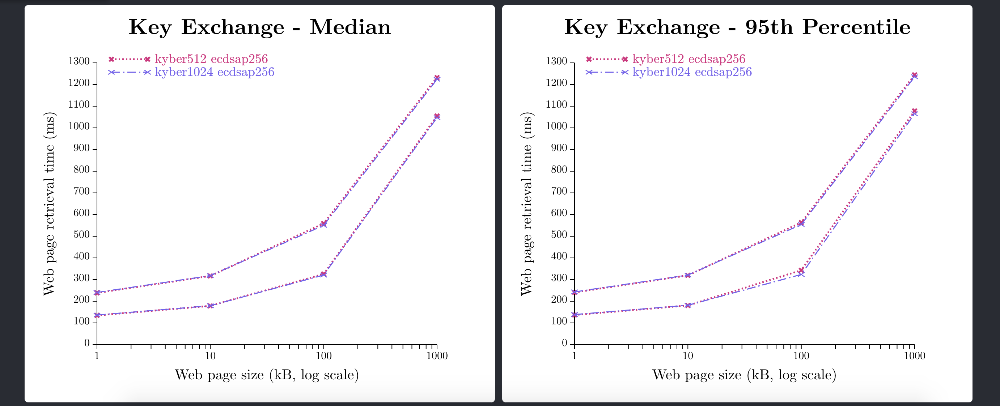

# visualization of internet-exp measurments
This project is meant for visualizing the results obtained from running the benchmark scripts in [frankimhof/internet-exp](https://github.com/frankimhof/internet-exp).
It will display the results in two seperate logarithmic line plots.


# Prerequisites
1. Run the benchmark scripts as described in [frankimhof/internet-exp](https://github.com/frankimhof/internet-exp) in order to obtain the results as .csv files.
2. Install [node.js](https://nodejs.org/en/download/)

# Installation
1. Run the following command to download the visualization software.

```
git clone --depth 1 --branch main https://github.com/frankimhof/internet-exp-viz
```

# Usage
1. Copy the .csv files (obtained from running the benchmarking scripts) into the `internet-exp/testresults` directory. Change into `internet-exp/testresults` directory and run the following command to convert .csv data into .json data.
```
node convert2.js
```
2. Change into `internet-exp` directory and run the following commands to start the server

```
npm install -g serve
serve -s build
```
3. Open [localhost:5000](http://localhost:5000) to view the test results.

# Development
If you wish to further develop the page, you are welcome to do so. The plots were built using [react.js](https://reactjs.org/) and [d3.js](https://d3js.org/). Therefore, after having installed the dependencies, you can utilize the available react scripts to run and build your changes.

## Install dependencies
Assuming current working directory is `/internet-exp-viz`

```
npm install
```

## Starting development server
```
npm start
```
Runs the app in the development mode.\
Open [http://localhost:3000](http://localhost:3000) to view it in the browser.

The page will reload if you make edits.\
You will also see any lint errors in the console.

## Building
```
npm run build
```
Builds the app for production to the `build` folder.
